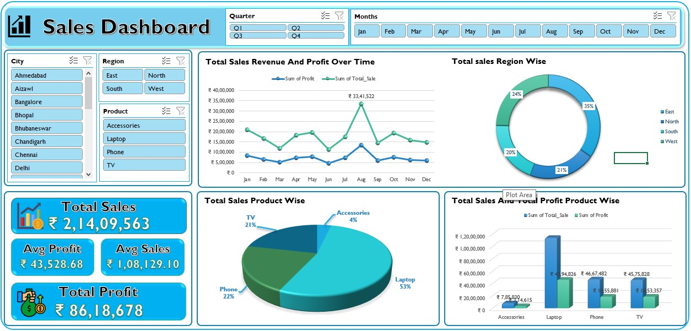

# 📊 TechVision Sales & Profit Analysis — 2024

A complete end-to-end **Business Intelligence project** for TechVision Pvt. Ltd., a consumer electronics company selling Laptops, Phones, TVs, and Accessories across Indian regions.

This project covers the full analytics workflow — from defining business requirements, to building an interactive Excel dashboard, to delivering executive-level insights in a presentation.

---

## 🖼️ Dashboard Preview



---

## 📁 Project Files

| File | Description |
|------|-------------|
| `BUSINESS REQUIREMENTS DOCUMENT.docx` | Defines project scope, KPIs, stakeholder goals, assumptions, and data requirements |
| `TechVision_Dashboard.xlsx` | Interactive Excel dashboard with slicers for Region, Product, City, Quarter, and Month |
| `Sales Analysis techvision.pptx` | Executive presentation summarizing key findings and strategic recommendations |

---

## 🎯 Project Objectives

- Track **total sales and profit** for 2024 across products, regions, and time periods
- Identify **top-performing segments** (Laptops, East region, August) and **weak areas** (March/June, South/North)
- Enable management to explore performance in **2–3 clicks** without manual ad hoc spreadsheets
- Provide **actionable recommendations** to boost weaker regions and optimize product strategy

---

## 📈 Key Results & Achievements

| KPI | Value |
|-----|-------|
| 💰 Total Sales Revenue | ₹2,14,09,563 (~₹21.41 Cr) |
| 📦 Total Profit | ₹86,18,678 (~₹8.62 Cr) |
| 📊 Overall Profit Margin | ~40% |
| 🛒 Avg Sales per Transaction | ₹1,08,129 |
| 💹 Avg Profit per Transaction | ₹43,528 |

### 🏆 What We Found

- **Laptops dominate** — 53% of total sales and the largest profit share among all products
- **East region leads** — contributing ~35% of total sales, the strongest performing region
- **August was the best month** — peak revenue of ₹33,41,522 in a single month
- **March and June underperformed** — identified as the weakest months in 2024
- **Accessories are the weakest product** — only 4% of sales, very low profit contribution
- **South and North regions lag** — combined they account for only ~41% of total sales

### 🎯 Recommendations Delivered

- Invest in **targeted campaigns** for South and North regions to close the gap with East
- Develop a strategy to **improve Accessories sales** — either bundle with Laptops or re-evaluate pricing
- **Capitalize on August peaks** by pre-loading inventory and running promotions
- Address **March and June dips** with seasonal offers or targeted outreach

---

## 🛠️ Tools & Skills Used

- **Microsoft Excel** — Data cleaning, Pivot Tables, KPI calculations, Slicers, Interactive Charts, Dashboard design
- **Microsoft PowerPoint** — Visual storytelling and executive summary presentation
- **Microsoft Word** — Business Requirements Documentation (BRD)
- **Data Analysis** — Sales trend analysis, regional/product segmentation, profit margin analysis

---

## 🔄 Project Workflow

```
Source Data (2024 TechVision Sales Dataset in Excel)
        ↓
Data Cleaning & Aggregation (Pivot Tables, KPI Calculations)
        ↓
Interactive Dashboard (Slicers: Region, Product, City, Month, Quarter)
        ↓
Insights & Recommendations (PowerPoint Presentation)
        ↓
Stakeholders: Management, Sales Managers, Finance Team
```

---

## 📌 Dashboard Features

- **Summary Tiles** — Total Sales, Total Profit, Avg Sales, Avg Profit
- **Monthly Trend Chart** — Sales and Profit over Jan–Dec 2024
- **Region-wise Donut Chart** — East, West, North, South breakdown
- **Product-wise Pie Chart** — Laptop, Phone, TV, Accessories share
- **Product Comparison Bar Chart** — Total Sales vs Profit by product
- **Interactive Slicers** — Filter by Quarter, Month, Region, City, Product

---

## 👤 Author

**Romaan Uddin Siddiqui** — Aspiring Data Analyst
📍 Bhopal, Madhya Pradesh
🔗 [GitHub Profile](https://github.com/rumman49)
🔗 [LinkedIn](https://www.linkedin.com/in/romaan-siddiqui)

---

## 💬 Feedback

Feel free to open an [issue](https://github.com/rumman49/TechVision-Sales-And-Profit-Analysis/issues) or connect via GitHub with questions or suggestions.

---

> ⭐ If you found this project useful, consider giving it a star!
